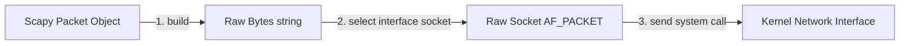

## 7.2. Scapy Internals and Packet Serialization

Writing raw packet injection code in C can be tedious. The **Scapy** framework simplifies this by providing a highly expressive, pythonic domain-specific language for low-level packet crafting, dissection, and transmission.

---

### 1. The Composition Operator (`/`)

Scapy represents network layers as distinct Python objects. It uses the division operator (`/`) to compose these layers into a single serialized packet, reading from left to right down the OSI stack:

```python
from scapy.all import Ether, ARP
# Composing an ARP reply packet
packet = Ether(dst="00:11:22:33:44:55", src="aa:bb:cc:dd:ee:ff") / ARP(op=2, psrc="192.168.1.1", pdst="192.168.1.50")
```

#### Behind the Scenes of `/`
Scapy overrides the Python magic method `__truediv__` (and `__rtruediv__`) inside its base `Packet` class. When Scapy evaluates `LayerA / LayerB`:
1. It instantiates both as independent layer objects.
2. It binds `LayerB` as the payload of `LayerA`.
3. It automatically updates parent fields (for example, setting the Ethernet frame's `type` field to `0x0806` to indicate that the payload is an ARP packet).

---

### 2. Packet Serialization and Transmission

When you pass an instantiated Scapy packet to a transmission function like `sendp()` (send at Layer 2), Scapy executes a multi-step serialization pipeline:



1. **`build()` Execution:** Scapy traverses the layer composition graph, calling the `build()` method on each layer from top to bottom. Each layer converts its internal parameters into a raw string of hexadecimal bytes, calculating checksums and length fields automatically.
2. **Raw Socket Allocation:** Scapy opens a raw socket bound to the selected physical network interface (e.g., `wlan0` or `eth0`).
3. **`send()` Invocation:** The raw serialized byte stream is passed to the kernel's socket system call, which transmits the physical signals across the network link.

---

###  Advanced Engineering Tips & Pitfalls
* **`send()` vs. `sendp()`:** A common mistake is using `send()` instead of `sendp()`. 
  * **`send()`** transmits packets at **Layer 3 (IP)**. The OS kernel handles the Layer 2 Ethernet headers dynamically.
  * **`sendp()`** transmits packets at **Layer 2 (Ethernet)**. You must explicitly define the link-layer headers (using `Ether()`). If you pass a packet containing `Ether()` to `send()`, the packet may be malformed or rejected by the kernel.

---
