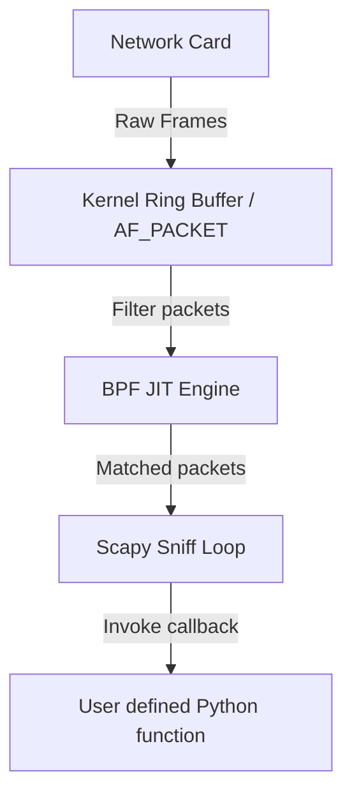

## 7.3. Real-Time Traffic Sniffing and Packet Filtering

To analyze network packets in real time and detect anomalies (like ARP spoofing attacks), we must capture and filter traffic efficiently.

---

### 1. The Sniffing Engine Architecture

Scapy's `sniff()` function is a powerful interface for capturing network packets. Under the hood, it allocates raw sockets and processes packets through a high-performance loop:



#### Kernel-Level Filtering (BPF)
If you capture all network traffic on a busy link, copying every single packet from kernel space to user space (Python) will quickly saturate the CPU, leading to packet loss.

To resolve this, Scapy leverages the kernel's **Berkeley Packet Filter (BPF)**. When you define a filter (e.g., `sniff(filter="arp")`), Scapy compiles the filter string into an optimized bytecode array and loads it directly into the kernel's packet-filtering engine. The kernel evaluates this bytecode on the network card's ring buffer and forwards **only** the matching packets to the Python application, reducing context-switching overhead.

---

### 2. Implementing High-Performance Sniff Callbacks

To maintain high capture performance and prevent memory exhaustion, your packet processing callbacks must be lightweight and non-blocking:

```python
# GOOD: Lightweight non-blocking callback
def my_sniff_callback(packet):
    if not packet.haslayer(ARP):
        return
    # Process instantly, avoid heavy computations or blocking I/O
    sender_ip = packet[ARP].psrc
    sender_mac = packet[ARP].hwsrc
```

* **`store=0`:** Always configure `sniff(store=0)` when running a continuous monitoring script. By default, Scapy stores every captured packet in an in-memory list. If left unconfigured, a long-running security monitor will eventually exhaust the host's RAM, causing the process to crash.
* **Non-blocking Callbacks:** Never perform heavy I/O operations (like writing to a database, executing DNS resolutions, or sending emails) directly inside the sniffing callback. If the callback blocks, the kernel's ring buffer can overflow, causing the kernel to drop incoming network packets. Instead, delegate heavy tasks to background workers or task queues.

---

###  Common Student Pitfalls & Pro-Tips
* **Missing BPF Compiler:** On some Linux platforms, compiling complex BPF filter strings can fail if the required low-level library (like `libpcap`) is missing. If you experience performance degradation or BPF compilation warnings, ensure that `libpcap` is installed on your host system:
  `sudo apt-get install libpcap-dev`.

---
