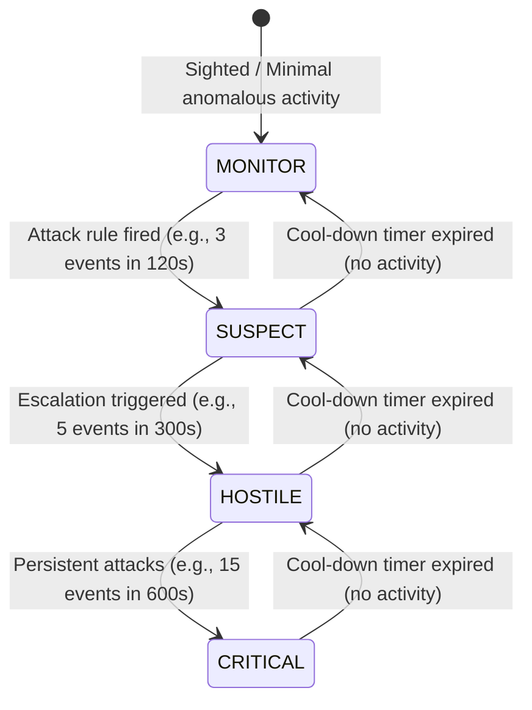

## 8.2. Finite-State Threat Escalation Algorithms

Once anomalous behavior is detected, the defense system must classify the severity of the threat. Using a binary "safe or malicious" classification is often ineffective. Instead, modern defense systems use a **Finite-State Machine (FSM)** to manage threat escalation dynamically.



---

### 1. The Four Threat States

* **`MONITOR`:** The default state for new or unknown network devices. The system monitors traffic passively and collects baseline performance metrics.
* **`SUSPECT`:** The device has triggered a minor security rule (e.g., a single gratuitous ARP packet). The system increases its log verbosity and prepares defense resources.
* **`HOSTILE`:** The device is actively attempting to poison local caches or execute a Man-in-the-Middle attack. The system activates automated countermeasures and alerts the administrator.
* **`CRITICAL`:** The attacker is persistent and aggressive, attempting to bypass countermeasures. The system escalates defense intensity to maximum power, deploying active device isolation to block the attacker's network path.

---

### 2. Time-Windowed Escalation Logic

The transitions between threat states are governed by a strict, time-windowed ruleset. For each incoming event, the system evaluates the frequency of attacks within a rolling time window:

$$\text{Recent Attack Count} = \sum_{i \in \text{Recent}} \mathbf{1}(t_i > t_{\text{now}} - W)$$

Where:
* $W$ is the duration of the evaluation window in seconds.
* $t_i$ is the timestamp of an individual attack event.

```python
# Configured Escalation Ruleset
ESCALATION_RULES = {
    "MONITOR":  {"attacks_to_next": 3,   "window_secs": 120},  # Escalates to SUSPECT if 3 attacks occur in 120s
    "SUSPECT":  {"attacks_to_next": 5,   "window_secs": 300},  # Escalates to HOSTILE if 5 attacks occur in 300s
    "HOSTILE":  {"attacks_to_next": 15,  "window_secs": 600},  # Escalates to CRITICAL if 15 attacks occur in 600s
    "CRITICAL": {"attacks_to_next": 999, "window_secs": 999},  # Max state
}
```

This multi-tiered validation prevents transient network glitches from triggering aggressive countermeasures, while ensuring that persistent, high-frequency attacks are met with a swift, powerful response.

---

###  Common Student Pitfalls & Pro-Tips
* **Hysteresis (Oscillation) Prevention:** If you do not configure a cooldown delay, a device hovering right on the boundary of an escalation threshold can bounce rapidly back and forth between states (e.g., `SUSPECT` and `HOSTILE`), generating a flood of redundant log messages and destabilizing your countermeasures. Always implement **Hysteresis** by requiring a prolonged period of silence (e.g., several minutes) before allowing a threat level to downgrade.

---
