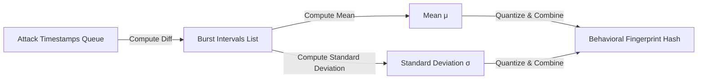

## 8.3. Behavioral Fingerprinting and Timing Signatures

Experienced attackers often spoof their MAC addresses to bypass security filters. To combat this, advanced defense systems analyze **Behavioral Fingerprints** derived from packet timing patterns, allowing them to identify the attacker regardless of their physical or logical network address.

---

### 1. Mathematical Analysis of Packet Timing

While an attacker can easily randomize their MAC address or rotate their IP address, the underlying execution patterns of their attack tools remain highly consistent. This is because these tools rely on hard-coded loops, operating system timers, and CPU scheduling to send packets.

By calculating the statistical **Mean**, **Variance**, and **Standard Deviation** of an attacker's inter-packet arrival times, we can construct a highly unique behavioral signature:



#### Step 1: Calculate the Mean ($\mu$)
The average duration of the inter-packet burst intervals:

$$\mu = \frac{1}{N} \sum_{i=1}^{N} \Delta t_i$$

#### Step 2: Calculate the Variance ($\sigma^2$)
Measures the spread of the burst intervals around the mean:

$$\sigma^2 = \frac{1}{N} \sum_{i=1}^{N} (\Delta t_i - \mu)^2$$

#### Step 3: Calculate the Standard Deviation ($\sigma$)
Quantifies the timing stability of the attack tool:

$$\sigma = \sqrt{\sigma^2}$$

---

### 2. Generating the Fingerprint Hash

Because physical networks introduce minor, random jitter, we must **quantize** our statistical results to prevent noise from altering the fingerprint:

```python
# Quantizing statistics to reduce network jitter noise
q_mean = round(mean, 2)    # Round mean to nearest 10ms
q_std = round(stddev, 2)   # Round stddev to nearest 10ms
techniques_str = ",".join(sorted(self.techniques))

# Combine into a serialized signature string
fingerprint_str = f"{q_mean}:{q_std}:{techniques_str}"
# Generate a short, unique cryptographic hash
fingerprint_hash = hashlib.sha256(fingerprint_str.encode()).hexdigest()[:16]
```

* **Fingerprint Mapping:** If a device with a new, unknown MAC address starts transmitting packets with a timing signature that matches an existing fingerprint in the blacklist database, the defense system instantly correlates the two, identifies the device as a known attacker, and inherits its previous threat level (e.g., escalating it directly to `HOSTILE`).

---

###  Advanced Engineering Tips & Pitfalls
* **Minimum Sample Size Constraints:** Never attempt to calculate a behavioral fingerprint using fewer than 5 sample packet intervals. Low sample sizes have extremely high statistical variance, which can lead to unstable signatures and false positive matches. Always require a minimum observation threshold before generating and saving a behavioral fingerprint.

---
