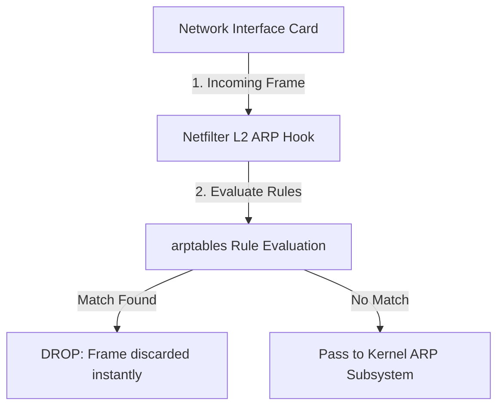

## 9.1. L2 Filtering with arptables and eBPF

To block malicious network frames before they reach user-space applications or consume CPU resources, we must implement packet filtering at the lowest levels of the operating system kernel.

---

### 1. Layer 2 Filtering via `arptables`

While standard Linux firewalls (such as `iptables` or `nftables`) filter Layer 3 (IP) and Layer 4 (TCP/UDP) packets, they are blind to Layer 2 ARP frames. To filter ARP traffic, Linux provides a dedicated kernel module and utility known as **`arptables`**.



`arptables` works by registering callbacks inside the Linux kernel's **Netfilter** framework. When an ARP frame is received:
1. The kernel pauses execution and passes the frame to the `arptables` evaluation loop.
2. The frame's headers are compared against the configured rule matrix.
3. If a match is found, the frame is discarded instantly, protecting the host's neighbor table from unauthorized updates.

```bash
# Block ARP frames claiming to be the gateway IP from non-gateway MACs
arptables -A INPUT -s 192.168.1.1 --src-mac ! 00:11:22:33:44:55 -j DROP

# Block ARP conflict attacks (frames claiming our own IP from external MACs)
arptables -A INPUT -s 192.168.1.50 -j DROP
```

---

### 2. High-Performance Filtering with eBPF (Extended Berkeley Packet Filter)

For maximum performance, modern systems implement packet filtering using **eBPF (Extended Berkeley Packet Filter)**.

eBPF allows developers to write sandboxed, high-performance programs that run directly inside the Linux kernel. By attaching an eBPF program to an **XDP (eXpress Data Path)** hook on the network driver:
* Incoming frames are evaluated directly on the network card's ring buffer, before the operating system allocates any packet buffers or processes any headers.
* Malicious frames are dropped at the lowest possible layer, allowing the host to withstand high-volume DDoS or packet-poisoning attacks without experiencing CPU starvation.

---

###  Common Student Pitfalls & Pro-Tips
* **Flushing Rules on Shutdown:** When building automated defense tools, always ensure that your application flushes its kernel packet-filtering rules upon shutdown. If your script crashes or exits without cleaning up its `arptables` rules, the host may remain locked in a static network state, blocking legitimate gateway updates and breaking local network routing. Always wrap your kernel modifications in a robust `try...finally` block.

---
