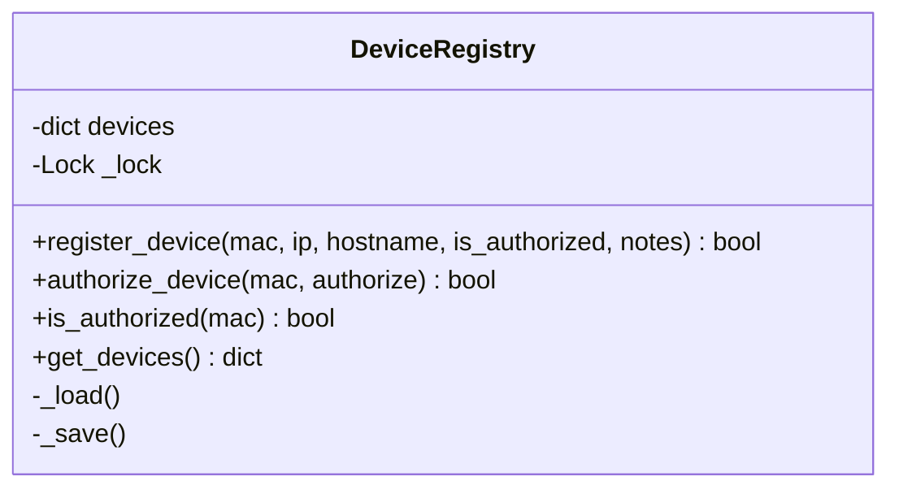

## 9.2. Device Registry Design and Access Control

To manage local network access effectively, a defense system must maintain an accurate, real-time inventory of all active devices, classifying them as either authorized (whitelisted) or unauthorized.

---

### 1. Designing the Device Registry

The **Device Registry** is the central database that tracks local network clients. To support high-frequency updates from network sniffers and discovery scanners, the registry must be designed with thread-safe data structures:



* **Thread-Safe Access:** Because the registry is updated concurrently by multiple background threads (e.g., the ARP packet sniffer and the active subnet scanner), all read and write operations on the internal `devices` dictionary must be protected by a **Mutual Exclusion Lock (Mutex)**.
* **Database Schema:** Each registered device is stored as a structured dictionary containing its metadata:

```json
{
  "00:1a:2b:3c:4d:5e": {
    "mac": "00:1a:2b:3c:4d:5e",
    "last_ip": "192.168.1.105",
    "hostname": "Discovered Host",
    "is_authorized": false,
    "first_seen": "2026-06-18T17:50:00.123456",
    "last_seen": "2026-06-18T17:53:00.654321",
    "notes": "unauthorized wireless client detected"
  }
}
```

---

### 2. Client Management Workflows

The registry provides administrative commands to manage device access:

* **Authorization Whitelisting:** Flags a device as trusted. The system will allow the device to communicate normally on the network.
* **De-authorization (Blocking):** Flags a device as untrusted or blocked. This triggers the active defense engine to isolate the device immediately, cutting off its network access.

---

###  Advanced Engineering Tips & Pitfalls
* **JSON Write-Saturating Hazard:** If your registry writes its entire JSON database to the host's disk on every single packet update, a busy network can easily saturate the disk's I/O queue, slowing down the system. Always decouple disk writes from in-memory updates. Use write-buffering algorithms, write-throttling timers, or a lightweight transactional database (like SQLite) to manage high-frequency persistence safely.

---
