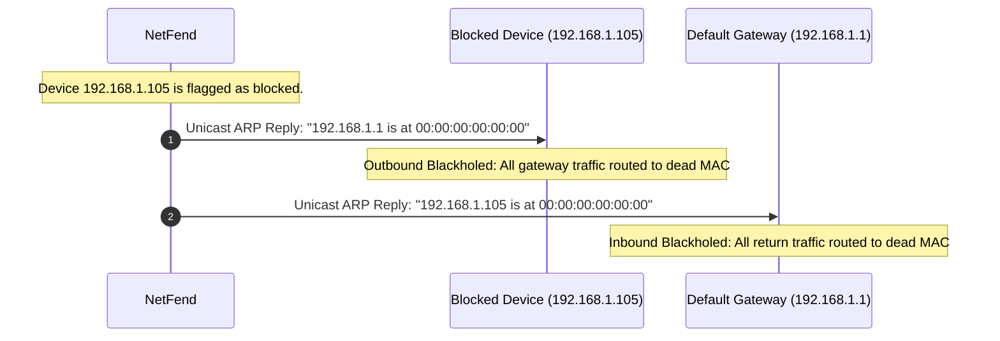

## 9.3. Target Poisoning and Network Blackholing

When a device is flagged as unauthorized or hostile, the active defense engine must isolate it from the network. It accomplishes this using **Target Poisoning** and **Network Blackholing**.

---

### 1. Active Client Isolation Mechanics

To block an unauthorized device from communicating on the network, the defense engine must isolate both its inbound and outbound communication paths. It achieves this by injecting conflicting address mappings, effectively wrapping the target in a local **Network Blackhole**.



#### Outbound Path Isolation (Poisoning the Client)
The defense engine transmits a continuous stream of unicast ARP reply packets directly to the blocked device's MAC address. These packets claim that the default gateway's IP address (`192.168.1.1`) maps to a dead, non-existent MAC address (such as `00:00:00:00:00:00`).
* When the blocked device attempts to send packets to the gateway, its network driver wraps the IP packets in Ethernet frames destined for the dead MAC address. These frames are dropped instantly by the network switch, blocking the device's outbound traffic.

#### Inbound Path Isolation (Poisoning the Gateway)
Simultaneously, the defense engine sends unicast ARP reply packets to the default gateway's MAC address. These packets claim that the blocked device's IP address (`192.168.1.105`) maps to the dead MAC address.
* When the gateway attempts to forward returning internet packets to the blocked device, it addresses the frames to the dead MAC address. The switch discards these frames instantly, blocking all inbound traffic to the target.

---

### 2. High-Performance Isolation Loops

Because the blocked device's operating system will periodically attempt to send standard ARP requests to discover the actual gateway, the isolation loop must run continuously:

```python
# Programmatic isolation loop execution
def isolate_unauthorized_devices(self):
    unauthorized = [mac for mac, info in self.registry.get_devices().items() if not info["is_authorized"]]
    dead_mac = "00:00:00:00:00:00"
    
    for mac in unauthorized:
        target_ip = self.registry.devices[mac]["last_ip"]
        # Poison target's outbound route
        poison_target = Ether(dst=mac) / ARP(op=2, psrc=self.gw_ip, hwsrc=dead_mac, pdst=target_ip)
        # Poison gateway's inbound route to target
        poison_gw = Ether(dst=self.gw_mac) / ARP(op=2, psrc=target_ip, hwsrc=dead_mac, pdst=self.gw_ip)
        
        sendp(poison_target, verbose=False)
        sendp(poison_gw, verbose=False)
```

This active injection loop keeps the blocked device isolated from both the default gateway and the rest of the local subnet, neutralizing any potential threat.

---

###  Common Student Pitfalls & Pro-Tips
* **The Static Gateway Cache Limitation:** If the default gateway has been manually configured with a static ARP mapping for the target device's IP address, the gateway will ignore your poisoning attempts. While the inbound path to the target will remain open, the outbound path from the target is still neutralized because the blocked device's local dynamic cache is successfully poisoned, keeping the threat contained.
